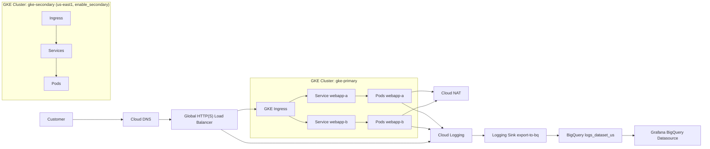

# GKE DevOps Architecture

## Overview
This design uses a primary GKE Standard cluster (`gke-primary`, `us-central1`) plus a symmetric secondary cluster (`gke-secondary`, `us-east1`) for multi-region high availability. The secondary is defined in Terraform and provisioned on demand via the `enable_secondary` variable (default `false` to stay within the free tier). Traffic enters through DNS and a global HTTP(S) load balancer, reaches GKE ingress, and is routed to two application services.

## Mermaid Diagram


## End-to-End Traffic Flow
1. Client resolves service hostname in Cloud DNS.
2. DNS maps to global load balancer frontend IP.
3. Global load balancer forwards to GKE ingress.
4. Ingress applies path routing:
   - `/a` -> `webapp-a`
   - `/b` -> `webapp-b`
5. Kubernetes services forward traffic to application pods.
6. Outbound traffic uses Cloud NAT.

## Observability Data Path
1. App logs and platform events are written to Cloud Logging.
2. Sink `export-to-bq` exports logs to BigQuery dataset `logs_dataset_us`.
3. Grafana queries BigQuery date-sharded tables (`stdout_*`, `stderr_*`, `events_*`, `requests_*`).
4. Dashboard panels visualize error rate, restart signals, latency percentiles, and activity trend.

## Troubleshooting: `table_invalid_schema`

### Symptom
Cloud Logging -> BigQuery export fails with sink errors containing `table_invalid_schema` when destination dataset was regional (`us-central1`).

### Diagnosis Commands
```powershell
gcloud logging sinks describe export-to-bq --project=PROJECT_ID --format=json
bq show --format=prettyjson --project_id=PROJECT_ID logs_dataset
gcloud logging read "logName=projects/PROJECT_ID/logs/logging.googleapis.com%2Fsink_error" --limit=20 --project=PROJECT_ID
```

### Fix
1. Use a multi-region dataset (`US`) named `logs_dataset_us`.
2. Grant sink writer identity `roles/bigquery.dataEditor`.
3. Repoint sink destination to the new dataset.
4. Keep Terraform aligned to avoid drift.

### IaC Alignment
- `terraform/main.tf`: BigQuery dataset location set to `US`.
- `terraform/variables.tf`: default dataset set to `logs_dataset_us`.
- Sink IAM uses `roles/bigquery.dataEditor` for the sink writer identity.

### Lesson Learned
For Logging exports to BigQuery, destination dataset location and schema behavior can create subtle failures; use multi-region datasets for stable ingestion and keep manual fixes reflected in Terraform immediately.
