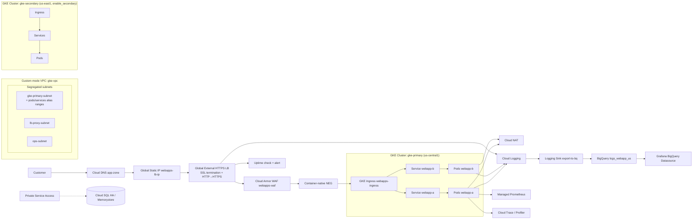

# GKE DevOps Architecture

## Overview
This design uses a primary GKE Standard cluster (`gke-primary`, `us-central1`) plus a symmetric secondary cluster (`gke-secondary`, `us-east1`) for multi-region high availability. The secondary is defined in Terraform and provisioned on demand via the `enable_secondary` variable (default `false` to stay within the free tier). Traffic enters through DNS and a global HTTP(S) load balancer, reaches GKE ingress, and is routed to two application services.

## Mermaid Diagram

```mermaid
flowchart LR
  U[Customer] --> DNS[Cloud DNS app-zone]
  DNS --> IP[Global Static IP webapps-lb-ip]
  IP --> GLB["Global External HTTPS LB<br/>SSL termination + HTTP→HTTPS"]
  GLB --> WAF[Cloud Armor WAF webapps-waf]
  WAF --> NEG[Container-native NEG]
  NEG --> ING[GKE Ingress webapps-ingress]

  subgraph VPC["Custom-mode VPC: gke-vpc"]
    subgraph SUBNETS["Segregated subnets"]
      GSUB[gke-primary-subnet<br/>+ pods/services alias ranges]
      LSUB[lb-proxy-subnet]
      OSUB[ops-subnet]
    end
  end

  subgraph GKE_PRIMARY["GKE Cluster: gke-primary (us-central1)"]
    SA[Service webapp-a]
    SB[Service webapp-b]
    PA[Pods webapp-a]
    PB[Pods webapp-b]
    ING --> SA --> PA
    ING --> SB --> PB
  end

  subgraph GKE_SECONDARY["GKE Cluster: gke-secondary (us-east1, enable_secondary)"]
    ING2[Ingress]
    S2[Services]
    P2[Pods]
    ING2 --> S2 --> P2
  end

  PA --> NAT[Cloud NAT]
  PB --> NAT
  PSA[Private Service Access] -.-> CSQL[(Cloud SQL HA / Memorystore)]

  PA --> LOGS[Cloud Logging]
  PB --> LOGS
  GLB --> LOGS
  PA --> GMP[Managed Prometheus]
  PA --> TRACE[Cloud Trace / Profiler]
  LOGS --> SINK[Logging Sink export-to-bq]
  SINK --> BQ[BigQuery logs_webapp_us]
  BQ --> GRAF[Grafana BigQuery Datasource]
  GLB --> UPT[Uptime check + alert]
```

## Network Segmentation
| Subnet | CIDR | Purpose |
|--------|------|---------|
| `gke-primary-subnet` | `10.10.0.0/20` (+ `gke-pods 10.11.0.0/16`, `gke-services 10.12.0.0/20`) | GKE nodes and VPC-native alias IP ranges |
| `lb-proxy-subnet` | `10.30.0.0/23` | `REGIONAL_MANAGED_PROXY` for L7 (Envoy) load balancers |
| `ops-subnet` | `10.40.0.0/24` | Monitoring / ops tooling, bastion, agents |
| PSA range | `/16` auto | Private Service Access peering for Cloud SQL HA / Memorystore |

## End-to-End Traffic Flow
1. Client resolves the app hostname in **Cloud DNS** (`app-zone`) → **global static IP** (`webapps-lb-ip`).
2. **Global external HTTPS load balancer** terminates TLS (Google-managed certificate) and redirects any HTTP to HTTPS.
3. **Cloud Armor WAF** (`webapps-waf`) inspects the request: OWASP SQLi/XSS preconfigured rules, per-IP rate limiting, and adaptive L7 DDoS defense.
4. The LB routes to a **container-native NEG**, hitting healthy pods directly (health check on `:8080/`).
5. GKE **Ingress** applies path routing: `/a` → `webapp-a`, `/b` → `webapp-b`.
6. Outbound pod traffic egresses via **Cloud NAT**; Google-managed services reach the VPC over **Private Service Access**.

## Observability Data Path
1. App logs and platform events are written to Cloud Logging.
2. Sink `export-to-bq` exports logs to BigQuery dataset `logs_webapp_us`.
3. Grafana queries BigQuery date-sharded tables (`stdout_*`, `stderr_*`, `events_*`, `requests_*`).
4. Dashboard panels visualize error rate, restart signals, latency percentiles, and activity trend.

## Dashboard Artifacts And Access
1. Grafana dashboard JSON: `grafana/dashboard.json`
  - Import path: Grafana UI -> Dashboards -> Import.
2. Cloud Monitoring dashboard JSON: `grafana/dashboard-cloud-monitoring.json`
  - Create path: `gcloud monitoring dashboards create --config-from-file=grafana/dashboard-cloud-monitoring.json --project=project-80744ff2-3e39-47f5-a73`
3. Current Cloud Monitoring dashboard URL:
  - `https://console.cloud.google.com/monitoring/dashboards/custom/ba5be944-8bbf-44fe-89ed-65946f67aa68?project=project-80744ff2-3e39-47f5-a73`
4. Current Grafana URL:
  - `http://136.64.53.196`

Note: The two JSON formats are not interchangeable. Importing the Cloud Monitoring JSON into Grafana, or uploading the Grafana JSON through Cloud Monitoring conversion, results in schema/conversion errors.

## Troubleshooting: `table_invalid_schema`

### Symptom
Cloud Logging -> BigQuery export fails with sink errors containing `table_invalid_schema` when destination dataset was regional (`us-central1`).

### Diagnosis Commands
```powershell
gcloud logging sinks describe export-to-bq --project=PROJECT_ID --format=json
bq show --format=prettyjson --project_id=PROJECT_ID logs_dataset
gcloud logging read "logName=projects/PROJECT_ID/logs/logging.googleapis.com%2Fsink_error" --limit=20 --project=PROJECT_ID
```

### Fix
1. Use a multi-region dataset (`US`) named `logs_dataset_us`.
2. Grant sink writer identity `roles/bigquery.dataEditor`.
3. Repoint sink destination to the new dataset.
4. Keep Terraform aligned to avoid drift.

### IaC Alignment
- `terraform/main.tf`: BigQuery dataset location set to `US`.
- `terraform/variables.tf`: default dataset set to `logs_webapp_us`.
- Sink IAM uses `roles/bigquery.dataEditor` for the sink writer identity.

### Lesson Learned
For Logging exports to BigQuery, destination dataset location and schema behavior can create subtle failures; use multi-region datasets for stable ingestion and keep manual fixes reflected in Terraform immediately.
