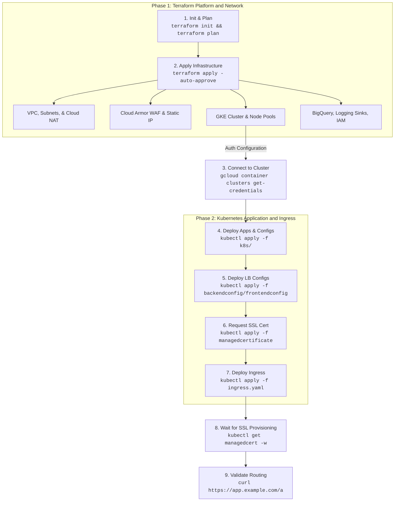

```mermaid
flowchart TD
  %% Grouping the Terraform Execution Phase
  subgraph Phase_1 [Phase 1: Terraform Platform and Network]
      direction TB
      TF_Init[1. Init & Plan<br/><code>terraform init && terraform plan</code>]
      TF_Apply[2. Apply Infrastructure<br/><code>terraform apply -auto-approve</code>]
      TF_VPC[VPC, Subnets, & Cloud NAT]
      TF_Sec[Cloud Armor WAF & Static IP]
      TF_GKE[GKE Cluster & Node Pools]
      TF_Obs[BigQuery, Logging Sinks, IAM]
      
      TF_Init --> TF_Apply
      TF_Apply --> TF_VPC
      TF_Apply --> TF_Sec
      TF_Apply --> TF_GKE
      TF_Apply --> TF_Obs
  end

  %% Wait sequence
  TF_GKE -->|Auth Configuration| Auth[3. Connect to Cluster<br/><code>gcloud container clusters get-credentials</code>]

  %% Grouping the Kubernetes Application Phase
  subgraph Phase_2 [Phase 2: Kubernetes Application and Ingress]
      direction TB
      K8S_App[4. Deploy Apps & Configs<br/><code>kubectl apply -f k8s/</code>]
      K8S_LB[5. Deploy LB Configs<br/><code>kubectl apply -f backendconfig/frontendconfig</code>]
      K8S_SSL[6. Request SSL Cert<br/><code>kubectl apply -f managedcertificate</code>]
      K8S_Ing[7. Deploy Ingress<br/><code>kubectl apply -f ingress.yaml</code>]
      
      K8S_App --> K8S_LB --> K8S_SSL --> K8S_Ing
  end

  Auth --> K8S_App

  %% Final Testing Phase
  K8S_Ing --> WaitSSL[8. Wait for SSL Provisioning<br/><code>kubectl get managedcert -w</code>]
  WaitSSL --> Test[9. Validate Routing<br/><code>curl https://app.example.com/a</code>]
```